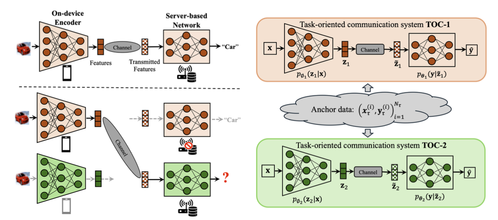

# Model-Agnostic Task-Oriented Communication with Feature Alignment



This is a PyTorch implementation of the [Toward Real-Time Edge AI: Model-Agnostic Task-Oriented Communication with Visual Feature Alignment](https://arxiv.org/abs/2412.00862):

```
@Article{xie2024realtimeedgeaimodelagnostic,
  title   = {Toward Real-Time Edge AI: Model-Agnostic Task-Oriented Communication with Visual Feature Alignment}, 
  author  = {Songjie Xie and Hengtao He and Shenghui Song and Jun Zhang and Khaled B. Letaief}
  journal = {arXiv preprint arXiv:2011.10566},
  year    = {2024},
}
```

## About

Due to intellectual property constraints, task-oriented communication (TOC) systems must be trained independently by each service provider, preventing the free sharing of optimized models between providers. Our goal is to tackle the cross-model challenges in TOC systems, where an edge server from one provider performs inference using features sent from edge devices of other providers.

Given the disparate architectures and distinct training processes that result in incoherent feature spaces, we are developing feature alignment techniques to enable cross-model inference in TOC systems across different service providers.

## Prerequisites

The codes are compatible with the packages:

- pytorch 2.0.1

- torchvision 0.15.2

- numpy 1.25.2

The code can be run on the datasets such as [The Street View House Numbers (SVHN)](http://ufldl.stanford.edu/housenumbers/) and [CIFAR-10](https://www.cs.toronto.edu/~kriz/cifar.html), etc. One should download the datasets in a directory (e.g., `./data/`) and change the root parameter in `datasets/dataloader.py`, e.g., 

```python
root = r'./data/
```

## Pre-Training of Independent TOC Systems

One can run `main_original.py` to train a TOC system and save the trained model in the given repository. For example, to train a VGG-based TOC model on SVHN and index it as 0 and save the trained model in `./local_SVHN`, run:

```shell
python main_original.py -d SVHN --model vgg --id 0 --r ./local_SVHN \
--sc 16 --snr 18
```

Then, the trained model will be saved in `./local_SVHN/vgg-0-awgn-12.0-16/`.

## Server-Based Feature Alignment (One-Shot Alignment)

For the server-based alignment between two TOC systems, one can load the trained models from different TOC systems and run `server_based_align.py`. 

For example, two independent TOC systems with the mixed architecture and ResNet-based architecture, named as `mixed-1-awgn-8.0-16` and `resnet-0-awgn-8.0-16`, respectively, are saved in `./local_SVHN`. To perform cross-model inference between them with LS-based alignment, run:

```shell
python server_based_align.py --align_method ls -r ./local_SVHN --enc_path mixed-1-awgn-18.0-16 --dec_path resnet-0-awgn-18.0-16  
```

## On-Device Feature Alignment (Zero-Shot Alignment)

Run `main_on_device_alignment.py` to train TOC systems with on-device feature alignment, e.g.,

```shell
python main_on_device_alignment.py --model vgg 
```

## Update
